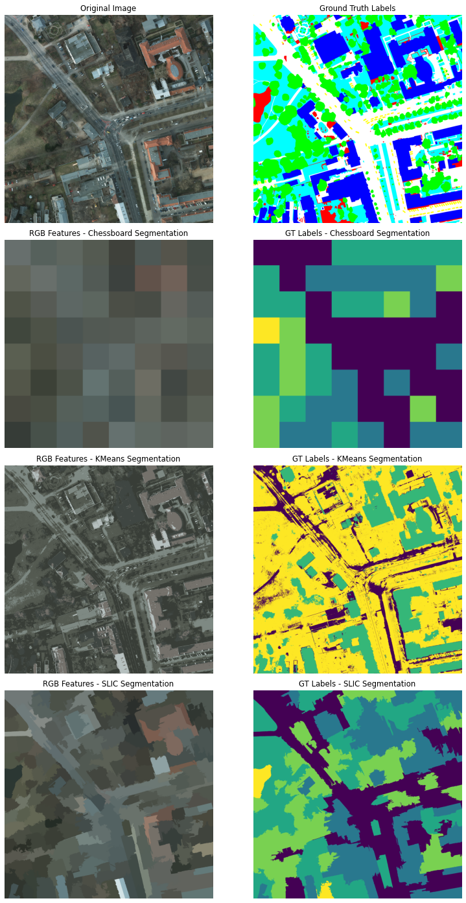
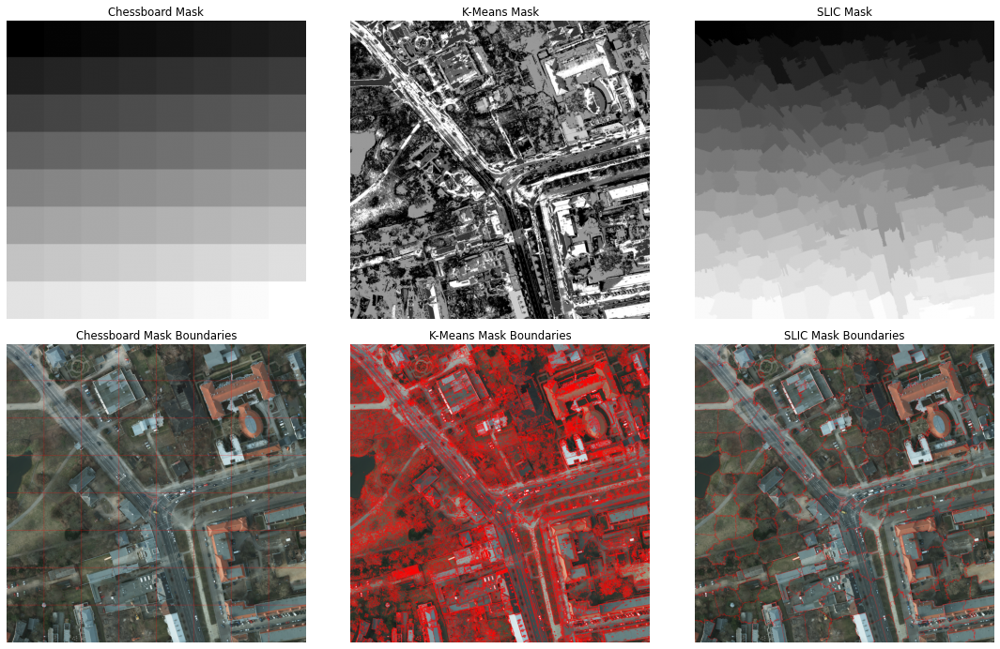
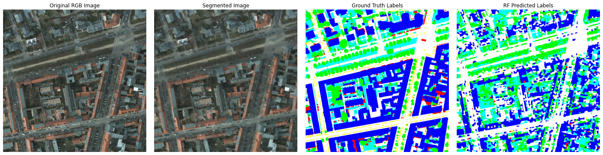
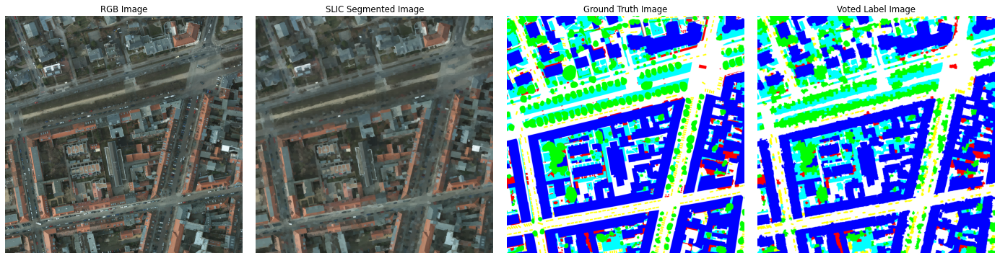
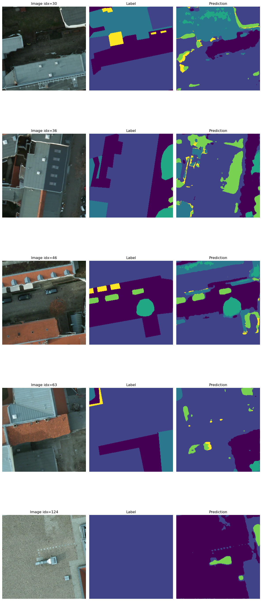

# Aerial Image Segmentation & Land-Cover Classification

A geospatial machine learning project for segmenting and classifying high-resolution aerial imagery using RGB, infrared (IR), and Digital Surface Model (DSM) data.

The project compares traditional image segmentation and machine learning methods with a deep learning approach for semantic land-cover classification.

## Project Overview

The objective was to extract meaningful spatial objects and classify land-cover categories from high-resolution aerial imagery.

The workflow covers image preprocessing, unsupervised segmentation, feature extraction, Random Forest classification, and CNN-based semantic segmentation.

### Main Workflow

- Preparation and exploration of RGB, IR, and DSM imagery
- Chessboard segmentation
- K-Means clustering
- SLIC superpixel segmentation
- Feature extraction from image segments
- Random Forest classification
- CNN-based semantic segmentation
- Evaluation and visualization of classification results

## Dataset

The project uses high-resolution aerial imagery from the **ISPRS Potsdam dataset**, including:

- RGB imagery
- Infrared information
- Digital Surface Model (DSM)
- Reference land-cover labels

The combination of spectral and elevation information provides complementary information for distinguishing urban objects and land-cover classes.

### Input Data



## Image Segmentation

Several segmentation approaches were explored before semantic classification.

### K-Means

K-Means clustering was used as an unsupervised approach to group pixels based on similarity in feature space.

### SLIC Superpixels

SLIC was used to divide the imagery into compact superpixels that better follow local object boundaries. These segments can then be used for object-based feature extraction and classification.



## Random Forest Classification

A Random Forest classifier was used for supervised land-cover classification. Features derived from the imagery and segmented regions were used to predict semantic classes.



### Evaluation

The classification results were compared with the available reference labels to assess model performance.



## CNN-Based Semantic Segmentation

A convolutional neural network was also explored for pixel-level semantic segmentation. This extends the project from traditional machine learning to a deep learning approach for learning spatial and spectral patterns directly from the imagery.



## Tools & Technologies

- Python
- Jupyter Notebook
- NumPy
- Matplotlib
- scikit-learn
- scikit-image
- PyTorch
- Random Forest
- K-Means
- SLIC Superpixels
- Convolutional Neural Networks (CNN)
- RGB / IR imagery
- Digital Surface Models (DSM)

## Repository Structure

```text
Aerial-Image-Segmentation/
├── README.md
├── notebooks/
│   ├── 01-image-segmentation.ipynb
│   ├── 02-random-forest-classification.ipynb
│   └── 03-cnn-semantic-segmentation.ipynb
└── images/
    ├── 01-input-data-overview.png
    ├── 02-slic-superpixels.png
    ├── 03-random-forest-classification.png
    ├── 04-random-forest-evaluation.png
    └── 05-cnn-semantic-segmentation.png
```

## Key Skills Demonstrated

Geospatial machine learning · Pattern recognition · Image segmentation · Feature extraction · Supervised and unsupervised learning · Random Forest · Deep learning · CNNs · Semantic segmentation · Remote sensing data analysis
